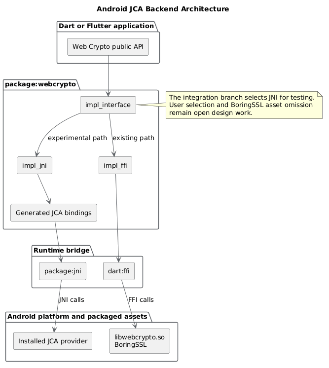

# Google Summer of Code 2026 Final Report

- Project: [Android JCA Backend for `package:webcrypto`](https://summerofcode.withgoogle.com/programs/2026/projects/hXF55vKW)
- Organization: [Dart](https://dart.dev/)
- Contributor: [M. Fazri Nizar](https://github.com/mfazrinizar)
- Mentors: [Hamdaan Ali Quatil](https://github.com/HamdaanAliQuatil) and [Jonas Finnemann Jensen](https://github.com/jonasfj)
- Project size: Large, 350 hours
- Repository: [google/webcrypto.dart](https://github.com/google/webcrypto.dart)
- Integration branch: [`google/webcrypto.dart:android-jca-branch`](https://github.com/google/webcrypto.dart/tree/android-jca-branch)

## Project Summary

`package:webcrypto` implements the Web Cryptography API for Dart and Flutter. Its native backend uses BoringSSL through Dart FFI. This project adds an experimental backend that calls Android's Java Cryptography Architecture (JCA) through `package:jni`.

During GSoC, I added JCA implementations for secure random, digest, HMAC, AES-GCM, AES-CBC, AES-CTR, RSASSA-PKCS1-v1_5, RSA-OAEP, RSA-PSS, ECDSA, ECDH, and HKDF to the integration branch. I kept PBKDF2 as an open experiment because Web Crypto accepts arbitrary password bytes while JCA's standard `PBEKeySpec` API accepts Java characters.

Shared and focused tests show that JCA can implement most of the package API and interoperate with the existing browser and BoringSSL backends. Production integration still requires a user-selectable backend, build-hook support, CI, PBKDF2 and RSA compatibility decisions, and a documented provider policy.

## Implementation

The backend follows the existing `impl_interface` contracts:

Backend code is in `lib/src/impl_jni/`. Reproducible JNIgen configuration and generated bindings are in `lib/src/third_party/jca/`. The generation setup uses Android API 36 and JDK 17.

Temporary JNI objects use scoped arenas. RSA and EC key wrappers retain one JCA key object through an isolate-unsendable owner, while `package:jni` manages the underlying global reference. The backend copies and releases attacker-triggerable Java exceptions before translating them to package error types.

The branch temporarily selects JNI for FFI-capable targets so desktop and Android tests can exercise the backend. Maintainers still need to design the user-facing selector.

## Primitive Status

| Primitive | JCA implementation | Status | Main PR |
| --- | --- | --- | --- |
| Secure random | `SecureRandom` | Merged | [#298](https://github.com/google/webcrypto.dart/pull/298) |
| SHA-1, SHA-256, SHA-384, SHA-512 | `MessageDigest` | Merged | [#296](https://github.com/google/webcrypto.dart/pull/296) |
| HMAC | `Mac` and `SecretKeySpec` | Merged | [#298](https://github.com/google/webcrypto.dart/pull/298) |
| AES-GCM | `AES/GCM/NoPadding` | Merged | [#300](https://github.com/google/webcrypto.dart/pull/300) |
| AES-CBC | `AES/CBC/PKCS5Padding` | Merged | [#304](https://github.com/google/webcrypto.dart/pull/304) |
| AES-CTR | `AES/CTR/NoPadding` with Web Crypto counter handling | Merged | [#316](https://github.com/google/webcrypto.dart/pull/316) |
| RSASSA-PKCS1-v1_5 | JCA `Signature` | Merged | [#323](https://github.com/google/webcrypto.dart/pull/323) |
| RSA-OAEP | JCA `Cipher` with OAEP parameters | Merged | [#340](https://github.com/google/webcrypto.dart/pull/340) |
| RSA-PSS | JCA `Signature` with `PSSParameterSpec` | Merged | [#341](https://github.com/google/webcrypto.dart/pull/341), [#375](https://github.com/google/webcrypto.dart/pull/375) |
| ECDSA | P-256, P-384, and P-521 | Merged | [#351](https://github.com/google/webcrypto.dart/pull/351) |
| ECDH | `KeyAgreement` on P-256, P-384, and P-521 | Merged | [#360](https://github.com/google/webcrypto.dart/pull/360) |
| HKDF | RFC 5869 over JCA `Mac` | Merged | [#356](https://github.com/google/webcrypto.dart/pull/356) |
| PBKDF2 | Raw-byte RFC 8018 loop over JCA `Mac` | Open experiment | [#357](https://github.com/google/webcrypto.dart/pull/357), [#361](https://github.com/google/webcrypto.dart/issues/361) |

## Milestones and Continuing Work

| Milestone | Proposed deliverable | Outcome |
| --- | --- | --- |
| M1 | Digest, HMAC, and AES-GCM | Complete; all three implementations merged. |
| M2 | AES-CBC, AES-CTR, RSASSA, RSA-PSS, and RSA-OAEP | Complete; all five implementations merged. |
| M3 | ECDSA, ECDH, HKDF, PBKDF2, and full API coverage | Partial; ECDSA, ECDH, and HKDF merged. PBKDF2 remains open in [#357](https://github.com/google/webcrypto.dart/pull/357) and [#361](https://github.com/google/webcrypto.dart/issues/361). |
| M4 | Performance, binary-size, documentation, and packaging analysis | In progress; measurements and provider findings exist, documentation is draft, and [#372](https://github.com/google/webcrypto.dart/issues/372) tracks packaging. |
| M5 | Cleanup, integrated branch, final report, and demo | In progress; the integration branch and report exist, while selector, CI, and production packaging remain open. |

I plan to continue the project after GSoC, starting with the open test and documentation PRs, followed by the PBKDF2, RSA compatibility, backend-selection, packaging, and CI work listed below.

## Validation Results

The shared `TestRunner` executes the same public API vectors against each backend. Focused tests also exchange keys, ciphertexts, and signatures between JNI/JCA and FFI/BoringSSL.

| Environment | Result | Notes |
| --- | --- | --- |
| Desktop JNI | 1,354 passed, 88 failed | PBKDF2 accounts for 46 failures. Desktop SunJCE rejection of 32- and 64-bit AES-GCM tags accounts for 42. |
| Android 16 / API 36 x86_64 emulator with [#375](https://github.com/google/webcrypto.dart/pull/375) | 1,397 passed, 46 failed | Every failure comes from the unmerged PBKDF2 path. |
| Android API 24 and 36 x86_64 emulators | 81/81 AES-GCM vectors passed | Both providers accepted every Web Crypto tag length, including 32 and 64 bits. |
| Android API 36 x86_64 emulator with [#375](https://github.com/google/webcrypto.dart/pull/375) | 366/366 RSA-PSS vectors passed | The provider requires PSS parameters after `initSign` or `initVerify`. |
| Android API 24 x86_64 emulator | 22 RSA-PSS vectors passed, 344 failed | The JNI backend rejects the provider's non-CRT private-key wrapper before RSA-PSS runs. API 25 and 26 reproduce the same import failure in focused tests. |

These results describe the tested emulators, APIs, ABIs, and providers. They do not define support for every Android or third-party JCA provider.

### PBKDF2 benchmark

The experimental PBKDF2 implementation preserves arbitrary password bytes but drives each HMAC iteration from Dart. The table reports median PBKDF2-HMAC-SHA-256 times after warm-up for a 256-bit output.

| Environment and backend | 1,000 iterations | 10,000 iterations | 100,000 iterations |
| --- | ---: | ---: | ---: |
| Desktop JVM-only JCA `Mac` control | 0.69 ms | 5.82 ms | 39.39 ms |
| Desktop FFI/BoringSSL | 0.60 ms | 2.59 ms | 20.99 ms |
| Desktop experimental JNI | 4.22 ms | 20.66 ms | 221.15 ms |
| Android 16 x86_64 emulator JNI | 52.39 ms | 84.91 ms | 913.15 ms |

The current loop crosses JNI and copies an intermediate value during each round. Issue [#361](https://github.com/google/webcrypto.dart/issues/361) tracks a production design that preserves raw bytes without this cost.

## Pull Requests

I opened 31 PRs during the project: 27 have merged, three remain open, and one remains draft.

### Merged

| # | PR | Title | Target | Status |
| ---: | --- | --- | --- | --- |
| 1 | [#296](https://github.com/google/webcrypto.dart/pull/296) | `feat(impl_jni): add JCA backend skeleton and digest path` | `android-jca-branch` | Merged |
| 2 | [#297](https://github.com/google/webcrypto.dart/pull/297) | `chore(jca): add generated JNI bindings` | `android-jca-branch` | Merged |
| 3 | [#298](https://github.com/google/webcrypto.dart/pull/298) | `feat(impl_jni): add JCA HMAC implementation` | `android-jca-branch` | Merged |
| 4 | [#300](https://github.com/google/webcrypto.dart/pull/300) | `feat(impl_jni): add JCA AES-GCM implementation` | `android-jca-branch` | Merged |
| 5 | [#301](https://github.com/google/webcrypto.dart/pull/301) | `chore(jca): add IvParameterSpec JNI binding` | `android-jca-branch` | Merged |
| 6 | [#304](https://github.com/google/webcrypto.dart/pull/304) | `feat(impl_jni): add JCA AES-CBC implementation` | `android-jca-branch` | Merged |
| 7 | [#305](https://github.com/google/webcrypto.dart/pull/305) | `chore(jca): update JNI toolchain to jni 1.0.0` | `android-jca-branch` | Merged |
| 8 | [#312](https://github.com/google/webcrypto.dart/pull/312) | `fix(testing): wire AES-GCM tagLength vectors` | `master` | Merged |
| 9 | [#313](https://github.com/google/webcrypto.dart/pull/313) | `chore: sync android-jca-branch with master` | `android-jca-branch` | Merged |
| 10 | [#316](https://github.com/google/webcrypto.dart/pull/316) | `feat(impl_jni): add JCA AES-CTR implementation` | `android-jca-branch` | Merged |
| 11 | [#317](https://github.com/google/webcrypto.dart/pull/317) | `chore(jca): add RSA JNI bindings` | `android-jca-branch` | Merged |
| 12 | [#323](https://github.com/google/webcrypto.dart/pull/323) | `feat(impl_jni): add JCA RSASSA-PKCS1-v1_5 implementation` | `android-jca-branch` | Merged |
| 13 | [#329](https://github.com/google/webcrypto.dart/pull/329) | `fix(ffi): validate JWK base64url encoding` | `master` | Merged |
| 14 | [#335](https://github.com/google/webcrypto.dart/pull/335) | `chore(jca): add RSA parameter JNI bindings` | `android-jca-branch` | Merged |
| 15 | [#337](https://github.com/google/webcrypto.dart/pull/337) | `fix: use canonical RSA-OAEP JWK alg for SHA-1` | `master` | Merged |
| 16 | [#338](https://github.com/google/webcrypto.dart/pull/338) | `chore: sync android-jca-branch with master` | `android-jca-branch` | Merged |
| 17 | [#339](https://github.com/google/webcrypto.dart/pull/339) | `docs: correct RSA-OAEP plaintext size limit` | `master` | Merged |
| 18 | [#340](https://github.com/google/webcrypto.dart/pull/340) | `feat(impl_jni): add JCA RSA-OAEP implementation` | `android-jca-branch` | Merged |
| 19 | [#341](https://github.com/google/webcrypto.dart/pull/341) | `feat(impl_jni): add JCA RSA-PSS implementation` | `android-jca-branch` | Merged |
| 20 | [#344](https://github.com/google/webcrypto.dart/pull/344) | `chore(jca): add EC key JNI bindings` | `android-jca-branch` | Merged |
| 21 | [#351](https://github.com/google/webcrypto.dart/pull/351) | `feat(impl_jni): add JCA ECDSA implementation` | `android-jca-branch` | Merged |
| 22 | [#353](https://github.com/google/webcrypto.dart/pull/353) | `chore(jca): add ECDH KeyAgreement JNI binding` | `android-jca-branch` | Merged |
| 23 | [#356](https://github.com/google/webcrypto.dart/pull/356) | `feat(impl_jni): add JCA HKDF implementation` | `android-jca-branch` | Merged |
| 24 | [#360](https://github.com/google/webcrypto.dart/pull/360) | `feat(impl_jni): add JCA ECDH implementation` | `android-jca-branch` | Merged |
| 25 | [#373](https://github.com/google/webcrypto.dart/pull/373) | `chore: sync android-jca-branch with master` | `android-jca-branch` | Merged |
| 26 | [#375](https://github.com/google/webcrypto.dart/pull/375) | `fix(impl_jni): configure RSA-PSS parameters after initialization` | `android-jca-branch` | Merged |
| 27 | [#376](https://github.com/google/webcrypto.dart/pull/376) | `fix(impl_jni): validate JWK base64url and RSA public imports` | `android-jca-branch` | Merged |

### Open and Draft

| # | PR | Title | Status | Notes |
| ---: | --- | --- | --- | --- |
| 28 | [#357](https://github.com/google/webcrypto.dart/pull/357) | `feat(impl_jni): add JCA PBKDF2 implementation` | Open | Experimental reference; production design remains open in [#361](https://github.com/google/webcrypto.dart/issues/361). |
| 29 | [#377](https://github.com/google/webcrypto.dart/pull/377) | `test(impl_jni): compare public error categories with FFI` | Open | Establishes cross-backend error-category coverage. |
| 30 | [#378](https://github.com/google/webcrypto.dart/pull/378) | `test(jni): initialize desktop JNI in standalone public-API tests` | Open | Makes standalone VM tests start the desktop JVM. |
| 31 | [#379](https://github.com/google/webcrypto.dart/pull/379) | `docs(jca): document experimental JCA backend status` | Draft | Records the provider evidence, limitations, and remaining integration work. |

## Issues

| # | Issue | Title | Status | Outcome or purpose |
| ---: | --- | --- | --- | --- |
| 1 | [#328](https://github.com/google/webcrypto.dart/issues/328) | `bug: FFI backend's JWK imports accept padded and standard Base64 values` | Closed | Fixed by [#329](https://github.com/google/webcrypto.dart/pull/329). |
| 2 | [#361](https://github.com/google/webcrypto.dart/issues/361) | `[Android JCA] Design production-ready PBKDF2 batching for the Android JCA backend` | Open | Tracks raw-byte semantics, JNI cost, and Java-helper packaging. |
| 3 | [#371](https://github.com/google/webcrypto.dart/issues/371) | `[Android JCA] Support RSA PKCS#8 imports when providers hide CRT parameters` | Open | Tracks API 24-26 provider compatibility. |
| 4 | [#372](https://github.com/google/webcrypto.dart/issues/372) | `[Android JCA] Design Android JCA backend opt-in and packaging` | Open | Tracks package boundaries, backend registration, and build-hook behavior. |

## Findings and Remaining Work

### Provider behavior

JCA exposes a common API, but providers differ in accepted parameters, algorithm aliases, and key wrapper types. The backend must report provider limitations without claiming one emulator represents Android as a whole.

Desktop SunJCE rejects 32- and 64-bit AES-GCM tags that Web Crypto permits. The tested Android API 24 and 36 providers accept them. Android API 36 resets RSA-PSS parameters during signature initialization, while the tested API 24-26 providers hide RSA CRT parameters after PKCS#8 import. PR [#375](https://github.com/google/webcrypto.dart/pull/375) fixes the API 36 parameter order, while issue [#371](https://github.com/google/webcrypto.dart/issues/371) tracks the API 24-26 key-wrapper problem.

### PBKDF2

`PBEKeySpec` cannot represent every Web Crypto password because it takes Java characters. A valid UTF-8 experiment matched FFI for tested inputs, but invalid UTF-8 bytes, empty-input behavior, and algorithm availability prevent it from serving as a compatible general implementation. The raw-byte implementation in [#357](https://github.com/google/webcrypto.dart/pull/357) remains functionally useful as an experiment, but its per-round JNI work is too expensive for production iteration counts.

### Packaging and binary size

The project has not delivered the proposed binary-size reduction yet. The current build hook still packages `libwebcrypto.so` even when the Dart code selects JNI. One measured x86_64 debug APK contained a 2.64 MB `libwebcrypto.so`. Issue [#372](https://github.com/google/webcrypto.dart/issues/372) tracks the backend selector, package split, and build setting required for a JCA-only Android build.

### Next steps

- Review and merge the active test and documentation PRs.
- Decide the PBKDF2 implementation boundary in [#361](https://github.com/google/webcrypto.dart/issues/361).
- Resolve RSA private-key imports for the supported provider and API range in [#371](https://github.com/google/webcrypto.dart/issues/371).
- Agree on backend registration, package ownership, and native-asset behavior in [#372](https://github.com/google/webcrypto.dart/issues/372).
- Run the shared suite through the public backend-selection path in desktop and Android CI.
- Re-measure release APK and AAB contents after the build hook can omit BoringSSL.
- Publish provider limitations and stable cross-backend error behavior.

## Acknowledgements

Thanks to Hamdaan Ali Quatil and Jonas Finnemann Jensen for reviewing the implementation and working through provider behavior, JNI ownership, testing, and packaging decisions. Thanks to the Dart team and the `webcrypto.dart`, `jni`, and `jnigen` contributors whose work made this backend possible.
